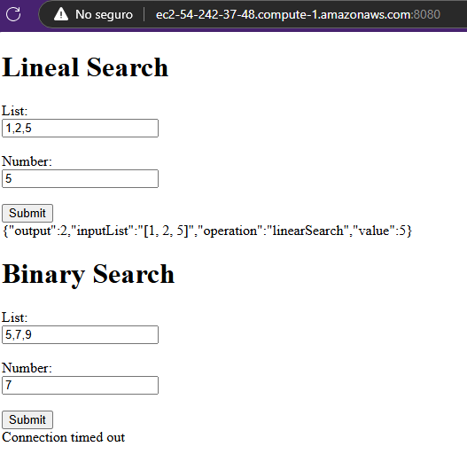
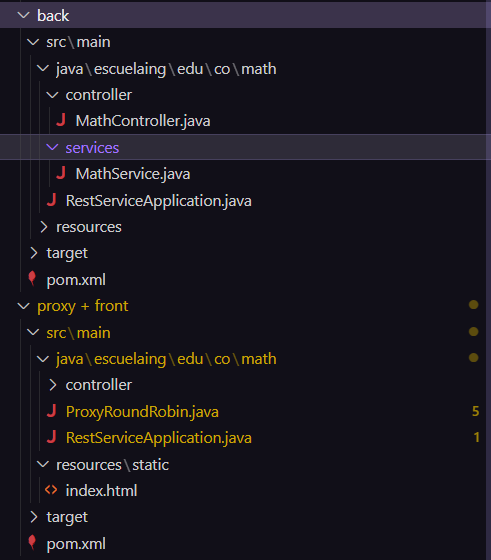
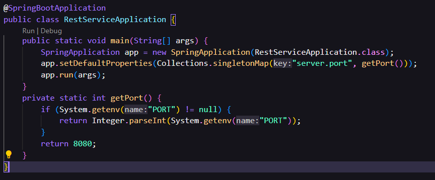
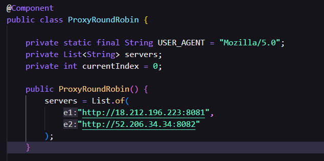

# AREP-PARCIAL02
## Autor David Leonardo Piñeros Cortés

En el primer commit logré implementar la lógica de ambas busquedas, con la clase controller que se encarga de llamar a estos métodos del service.
Sin embargo no logré conectar el front con el controller ya que al hacer la petición al back fallaba por la forma en como tomaba
los parámetros.

La parte que me falta implementar es el servidor proxy el cual envía de manera intercalada las peticiones al back si se tuvieran mas instacias
desplegadas. Este servidor tiene un algoritmo Round Robin el cuál es un balanceador de carga y tiene la siguiente estructura en 
(indiceDominios + 1) % dominios.lenght, esto para intercambiar de manera circular las peticiones al back. 

Luego de estas implementaciones se generan los archivos jar del servidor proxy junto con el front, luego otro jar con el servidor backend, esto
teniendo en cuenta que las peticiones del proxy server se deben cambiar hacia la dirección URL que se asignen en EC2, con su respectivo puerto
asignado en el application properties o en la clase de SpringApplication.

## Avance en Casa
Pruebas de la aplicacion corriendo localmente

También logré implementar el proxy localmente y el despliegue en AWS: https://youtu.be/tj-RUvNwIf0

Para esto separé el proyecto en dos subproyectos. Uno con el front y el servidor proxy y el otro subproyecto con los services del back.

Posteriormente habilité habilité la opción de cambiar los puertos en donde se ejecuta spring y se ejecutaron 2 instancias con el back y una para front y proxy

Finalmente agregé las direcciones de las dos instacias en la lista de servidores de services disponibles

